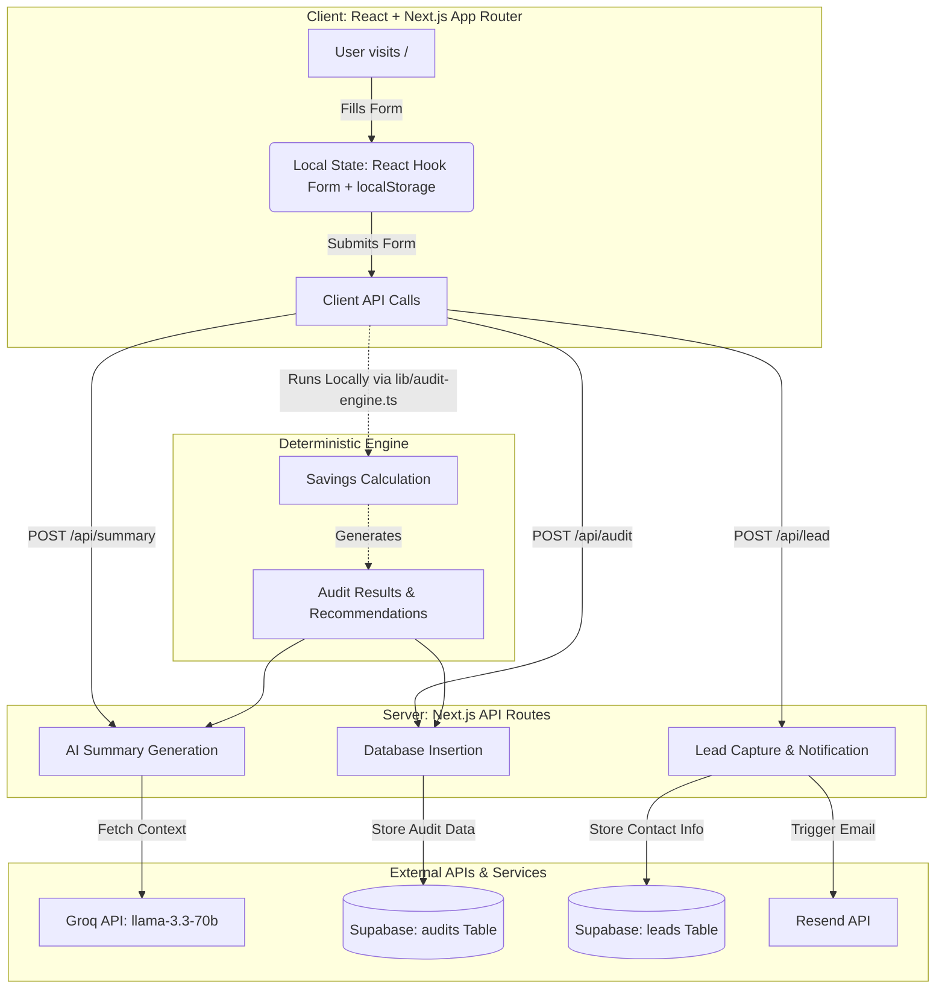

# System Architecture

## Overview
AI Spend Audit is a serverless Next.js 15 application designed to capture lead data by providing a high-value financial audit of a company's AI tool spend. It uses a hybrid architecture, combining a deterministic audit engine for precise financial calculations with generative AI for qualitative analysis.

## System Flow & Data Pipeline

## Architectural Decisions

### 1. Deterministic Audit Engine vs AI Math
**Why deterministic audit logic was used instead of an LLM:**
LLMs are notoriously unreliable at arithmetic and strict logical deductions. If a user states they have 10 seats of ChatGPT Team at $30/user/mo, and we need to compare that to an enterprise tier that requires a minimum of 15 seats at $25/user/mo, the logic must be flawless. Using a hard-coded, deterministic engine (`lib/audit-engine.ts`) ensures that financial recommendations are 100% accurate, reliable, and testable. AI is kept completely out of the critical path for financial math.

### 2. Groq for AI Summaries
**Why Groq was limited to summaries:**
While the math is handled deterministically, users still value a human-like, qualitative summary of their stack. Groq (using Llama-3.3-70b) was selected for its ultra-low latency. Because the summary is generated on-demand while the user waits on the results page, speed is paramount. Groq takes the *already calculated* deterministic output and simply synthesizes it into a professional, easily digestible paragraph.

### 3. Supabase Selection
**Why Supabase was selected:**
Supabase provides PostgreSQL with robust Row Level Security (RLS). This is critical because:
1. We need to allow unauthenticated, anonymous users to insert audit records (to reduce friction).
2. We need to allow public reading of specific audit records (for shareable links).
3. We MUST strictly prevent public reading of the `leads` table to avoid PII leaks.
Supabase handles this complex permission matrix natively without requiring a heavy backend layer.

## Scaling Strategy

### Scaling to 10k Audits/Day
If the application experiences explosive growth to 10,000 audits per day, several architectural adjustments would be necessary:

1. **Groq API Rate Limits**:
   - *Problem*: 10k requests/day might hit rate limits or concurrency caps.
   - *Solution*: Implement a background queue (e.g., Upstash/Redis) or switch the AI summary generation to be asynchronous. If the API fails or is slow, the UI will gracefully fall back to a generic deterministic summary (which is already implemented).
   
2. **Database Reads (Shareable Links)**:
   - *Problem*: Open Graph preview bots (Twitter, LinkedIn, Slack) will hammer the database for `/audit/:id` reads.
   - *Solution*: Enable Next.js Incremental Static Regeneration (ISR) with Edge caching on the results page. This will cache the audit result at the Edge, reducing database load to near zero for read-heavy viral links.
   
3. **Database Writes**:
   - *Problem*: While Supabase can easily handle 10k inserts/day, violent traffic spikes could cause connection pooling issues in serverless environments.
   - *Solution*: Implement batch processing for lead and audit inserts if necessary, or ensure Prisma/Supabase client uses a robust connection pooler like PgBouncer.
