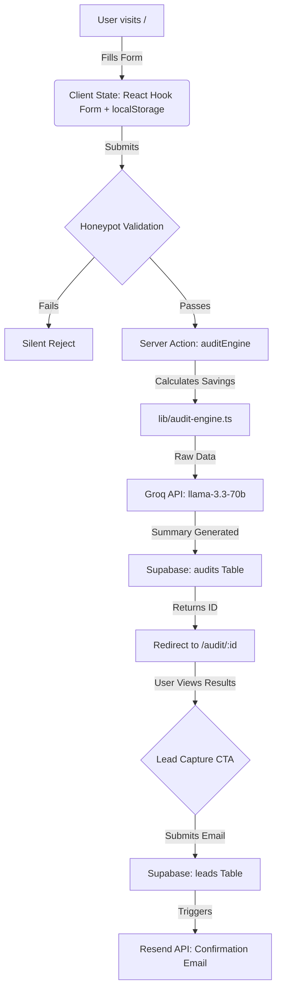

# System Architecture

## Overview
AI Spend Audit is a serverless Next.js 15 application designed to capture lead data by providing a deterministic, high-value financial audit of a company's AI tool spend.

## System Flow & Data Pipeline

## Stack Justification
- **Next.js 15 (App Router)**: Enables mixing Server Components for performance/SEO and Client Components for the interactive form. The API routes power the OG Image generation securely.
- **Supabase**: Postgres with Row Level Security (RLS) allows us to accept anonymous audit submissions while securely locking down lead data from public read access.
- **Groq API**: Offers extremely low-latency generation, which is crucial since the user is waiting for the form submission to complete. We use `llama-3.3-70b-versatile` for high-quality narrative synthesis without math hallucination risks.
- **Zod**: Ensures strict typing and validation at the form level before hitting any API.

## Scaling to 10k Audits/Day
If we scale to 10,000 audits per day:
1. **Groq API Rate Limits**: We would likely hit rate limits. **Solution**: Implement background queueing for the AI summary generation via Upstash/Redis, or fall back to static deterministic summaries gracefully during peak load.
2. **Database Reads**: Open Graph preview bots (Twitter, Slack) will hammer the database for `/audit/:id` reads. **Solution**: Enable Next.js ISR (Incremental Static Regeneration) on the results page to cache the audit result at the Edge, reducing database load.
3. **Database Writes**: Supabase can handle 10k inserts/day easily, but we might want to batch lead inserts if traffic spikes violently.
