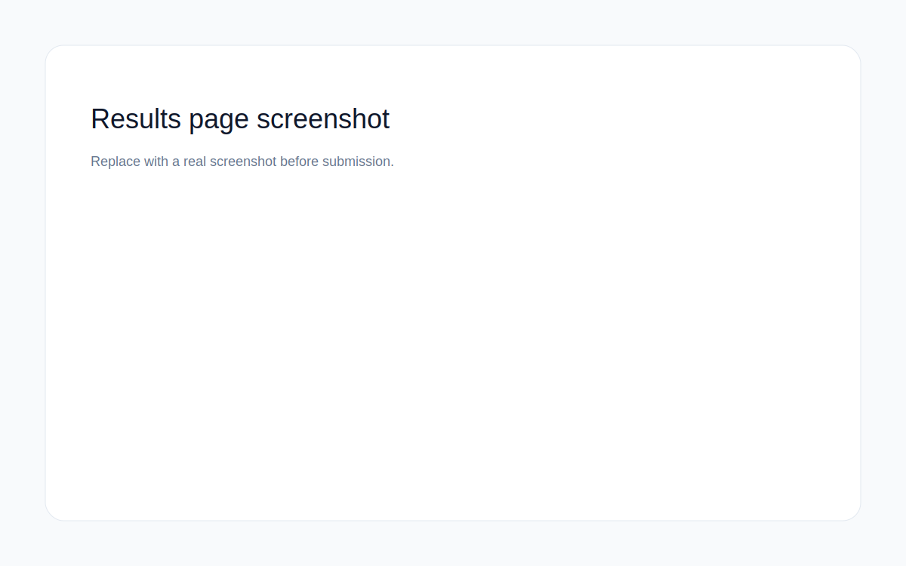
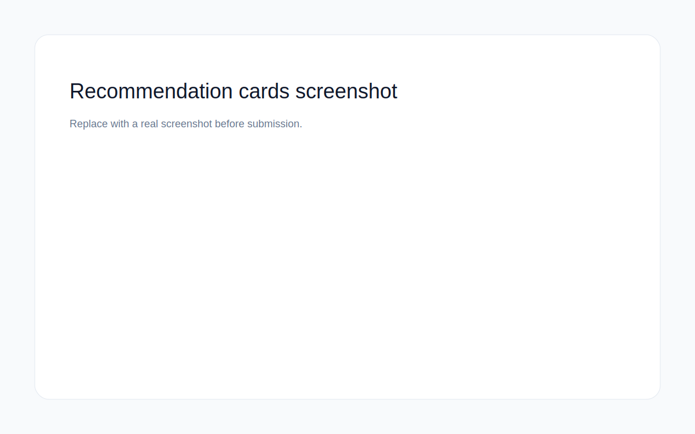

# AI Spend Audit

AI Spend Audit is a deterministic web app that helps startup teams identify waste in their AI tool stack and quantify realistic monthly and annual savings. It is designed for founders and engineering managers who need a finance-ready report they can act on immediately.

**Live URL:** https://your-deployed-url.com

## Screenshots





## Key Features
- Deterministic audit engine with per-tool recommendations and savings math
- AI-generated executive summary with safe fallback when the API is unavailable
- Lead capture with Supabase storage and Resend transactional email
- Shareable public audit URL with Open Graph metadata

## Architecture Overview
- Next.js App Router frontend in [app/page.tsx](app/page.tsx)
- Deterministic logic in [lib/audit-engine.ts](lib/audit-engine.ts) and [lib/optimization-rules.ts](lib/optimization-rules.ts)
- Pricing source of truth in [lib/pricing.ts](lib/pricing.ts) with citations in PRICING_DATA.md
- API routes for audit persistence, summary generation, and lead capture in [app/api](app/api)
- Supabase storage for audits and leads, with PII separated from public audit data

## Quick Start
```bash
npm install
npm run dev
```

## Environment Variables
Create `.env.local` in the repo root:
```env
NEXT_PUBLIC_SUPABASE_URL=your_supabase_url
NEXT_PUBLIC_SUPABASE_ANON_KEY=your_supabase_anon_key
GROQ_API_KEY=your_groq_api_key
RESEND_API_KEY=your_resend_api_key
RESEND_FROM=AI Spend Audit <onboarding@resend.dev>
NEXT_PUBLIC_APP_URL=https://your-deployed-url.com
```

## Testing
```bash
npm run test
```

## Linting
```bash
npm run lint
```

## Production Build
```bash
npm run build
```

## Deployment Guide
1) Deploy to Vercel or another Next.js-compatible host.
2) Add all environment variables from `.env.local` to your host.
3) Ensure Supabase RLS is configured so `audits` are readable by id but `leads` are not publicly readable.
4) Verify the live URL and shareable `/audit/[id]` page load with valid metadata.

## Key Engineering Decisions
1) Deterministic pricing logic for all savings math to prevent LLM hallucinations.
2) Local storage for form state to minimize friction before value is shown.
3) Usage-based plan metadata to keep API spend recommendations realistic.
4) Separate audit and lead storage in Supabase to protect PII.
5) Server-side summary generation to keep API keys out of the client.

## Tradeoffs (minimum 5)
1) Custom enterprise pricing is labeled as “custom” rather than modeled with a guessed number.
2) Audits are stored anonymously to reduce friction; this sacrifices personalized dashboards.
3) The first version uses simple rule-based optimization rather than a heavier optimization solver.
4) API spend is compared against subscription alternatives, which may not reflect enterprise contract nuances.
5) Shareable URLs are public by design, so users must opt-in by submitting email.
